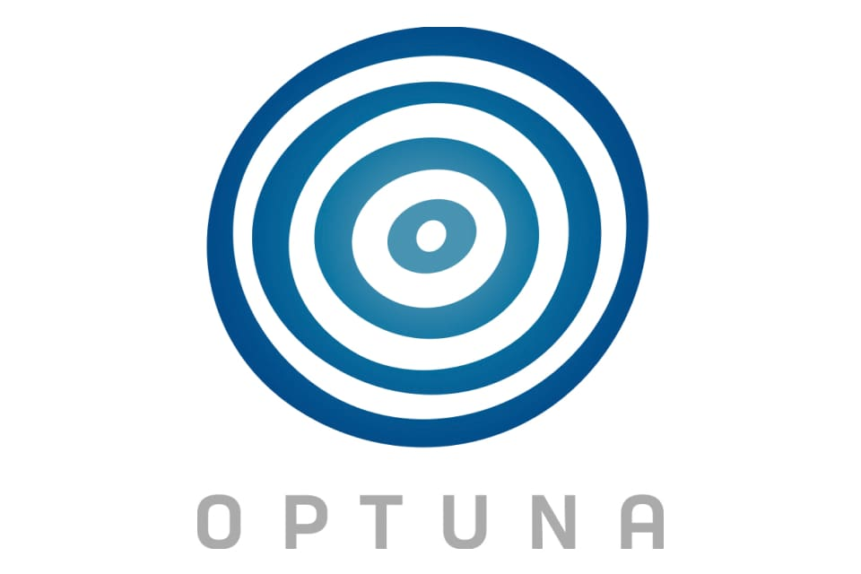

# Machine learning project on Formula One data

### Project goal
The aim was to forecast the winner of each race of the season in Formula 1. To do this, machine learning methods were used.

### Data source
https://www.kaggle.com/datasets/rohanrao/formula-1-world-championship-1950-2020

### Project steps
- Data analysis
- Feature Engineering
- ML model : Regression tree, XGBoost
- GridSearchCV
- Optuna : automatic hyperparameter optimization

### Libraries used
optuna, xgboost, sklearn, pandas

